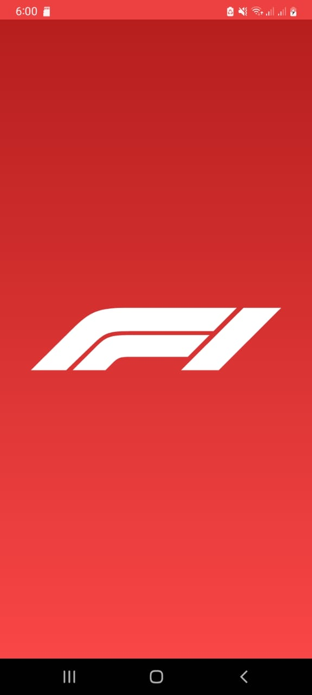
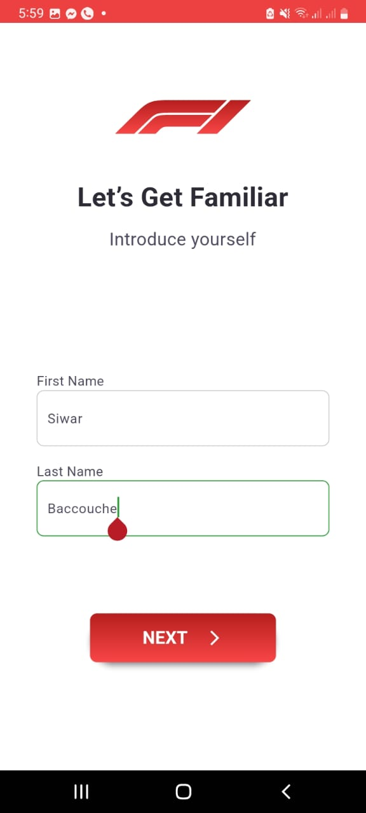
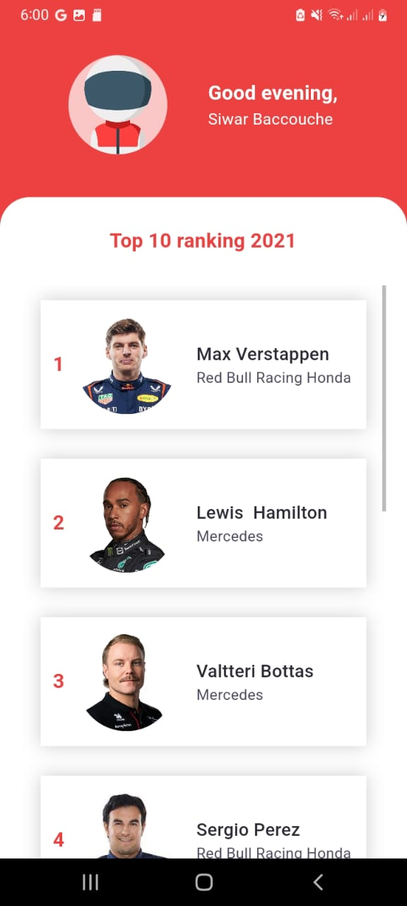

# Formula_1

## Flutter Mobile App

## Context
Over the years, Fomula 1 has taken on a global dimension and is, along with the Olympics and the FIFA World Cup, one of the most widely televised sporting events.

In the following exercise, we aim to develop a mobile application that allows users, once the application is launched, to create an account and view the ranking of Formula 1 drivers by displaying the details of each of them.

## Screens of the Application 

### A splash screen 
    Displayed for 1 second before proceeding to the next screen.

### A registration screen
    Requests the "first name" and "last name" parameters with the necessary controls (no special characters and numbers or empty fields).

### A home screen:
    Displays a greeting message according to the period of time of the day with the name of the authenticated user.
    Lists the Formula 1 drivers with a ranking order.

### Note 
    Since it's not mentioned how we should handle exiting the app from the home screen, I've used a WillPopScope() and an AlertDialog as follows

## Script
Please check the master branche